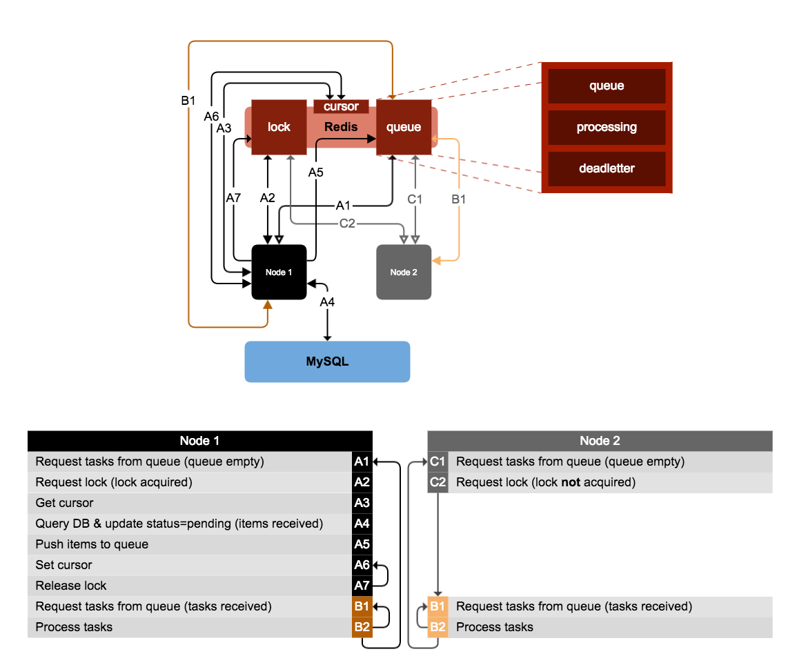

Query Swarm
===========

Query Swarm allows you to safely distribute query-driven tasks over a swarm of parallel functions on a single process or across multiple processes/machines.



tl;dr
-----

```js
var redis = require('redis').createClient();
var QuerySwarm = require('../lib/QuerySwarm.js')(redis);

function query(cursor, callback) {
	// you can get a starting cursor from another data source if you wish
	cursor = cursor || 0;

	// perform the query (you would probably connect to a database here...)
	var results = [], newCursor = cursor;
	while (newCursor < cursor + 100) {
		results.push(newCursor);
		newCursor++;
	}

	// return any error, the new cursor, and results
	callback(null, newCursor, results);
}

function worker(task, callback) {
	// do something with the task
	var result = task * 2;

	// return any error, and the result
	callback(null, result);
}

var swarm = new QuerySwarm('myFirstSwarm', query, worker);
swarm.start();
swarm.stop(function(){
	// this node has gracefully stopped
});

```

####Use when the following are important:
- Tasks should be allowed a long time to complete
- Each task must only ever be processed once
- Failed tasks must not just "disappear"
- Nodes should shutdown gracefully

####Do *not* use if the following are required:
- Tasks must be strictly processed in order

Requirements
------------

Query Swarm relies on [redis](http://redis.io) to store the lock, cursor, queue, and lists responsible for swarm coordination.


Usage
-----

See tl;dr above.


Events
------

- error: Error, [message]
- populate: cursor, tasks
- consume: task, [result]
- deadletter: task
- acknowledge: task
